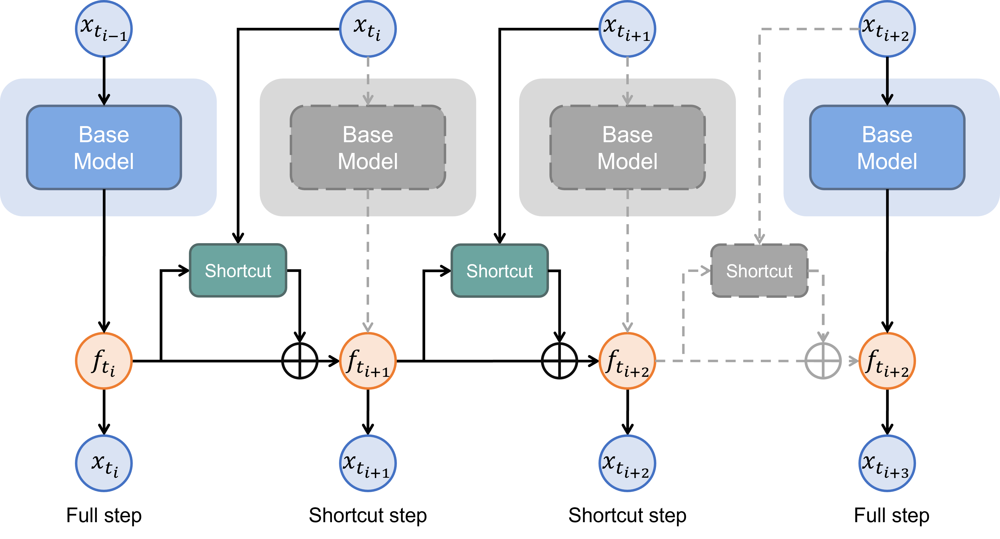
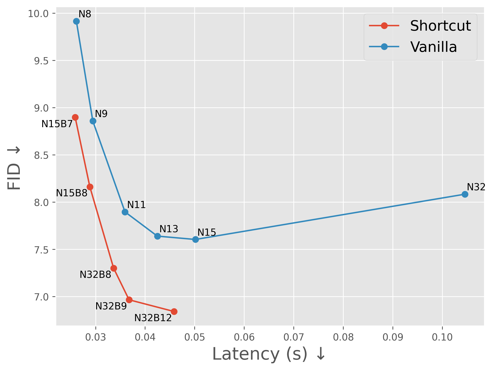
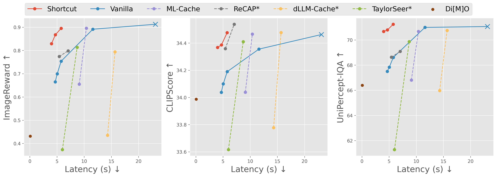

# Accelerating Masked Image Generation by Learning Latent Controlled Dynamics

<!-- [Paper]() | [Project Page]() -->


## Introduction
+ In MIGMs, the trajectory of model features is often smooth.
+ We hypothesize that it is easy to predict the next feature from the current feature.
+ We propose a lightweight model to learn this mapping, taking as input the current feature and newly sampled tokens, and outputting the next feature.
+ Applying this method to [MaskGIT](https://arxiv.org/abs/2202.04200) and [Lumina-DiMOO](https://arxiv.org/abs/2510.06308) greatly pushes the Pareto frontier of quality-speed trade-off.
<div align='center'>

<br>
Colored blocks and solid lines represent activated computation, while gray blocks and dash lines represent suppressed computation. At a full step, the inference is the same as the vanilla procedure. At a shortcut step, the lightweight shortcut model replaces heavy base model.
</div>


## Performance

### On MaskGIT
<div align='center'>

<br>
N denotes the number of total steps, and B denotes the number of full steps.
</div>

### On Lumina-DiMOO
<div align='center'></div>

<div align='center'>

<br>
Other acceleration methods suffer from notable performance degradation under high acceleration rates, while our method maintains the quality.
</div>


## Usage
+ Set up the environment
  ```
  conda create -n migm-shortcut python=3.13.5
  conda activate migm-shortcut
  pip install -r requirements.txt
  ```
+ See [MaskGIT-Shortcut](MaskGIT-Shortcut/README.md) and [DiMOO-Shortcut](DiMOO-Shortcut/README.md)


## Acknowledgement
This repository is built upon [valeoai/MaskGIT PyTorch](https://github.com/valeoai/Halton-MaskGIT/tree/v1.0) and [Alpha-VLLM/Lumina-DiMOO](https://github.com/Alpha-VLLM/Lumina-DiMOO). Thanks for these awesome works.


<!-- ## BibTex -->
